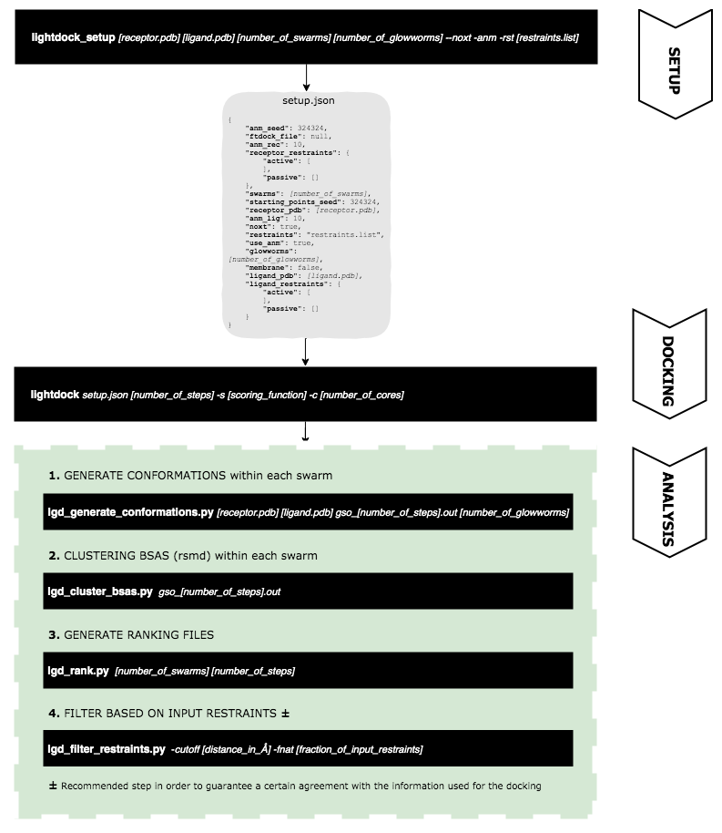

# LightDock Protein-Protein Benchmark 5 Data

## Description

* results: this folder contains for each complex from the BM5 and for each scenario (BLIND, PAIR, TI, TI-REC, TI-25 and TI-50) a file with extension `.list` where for each structure predicted by the protocol its name, interface-RMSD, ligand-RMSD, fraction of native contacts and the final score.

* data: for each complex, the initial PDB structures used (`$complex_A-noh.pdb`, `$complex_B-noh.pdb`), the reference (`*.segid.pdb`) and for each scenario `setup.json` and `lightdock.info` files.

## Reproduction of results

For the reported results, the following parameters were used:

* `initial_swarms`: 400
* `number_of_glowworms`: 200
* `number_of_steps`: 100
* `scoring_function`: fastdfire
* `number_of_cores`: 48
* `distance_in_Å`: 5.0
* `fraction_of_input_restraints`: 0.4 (40%)

