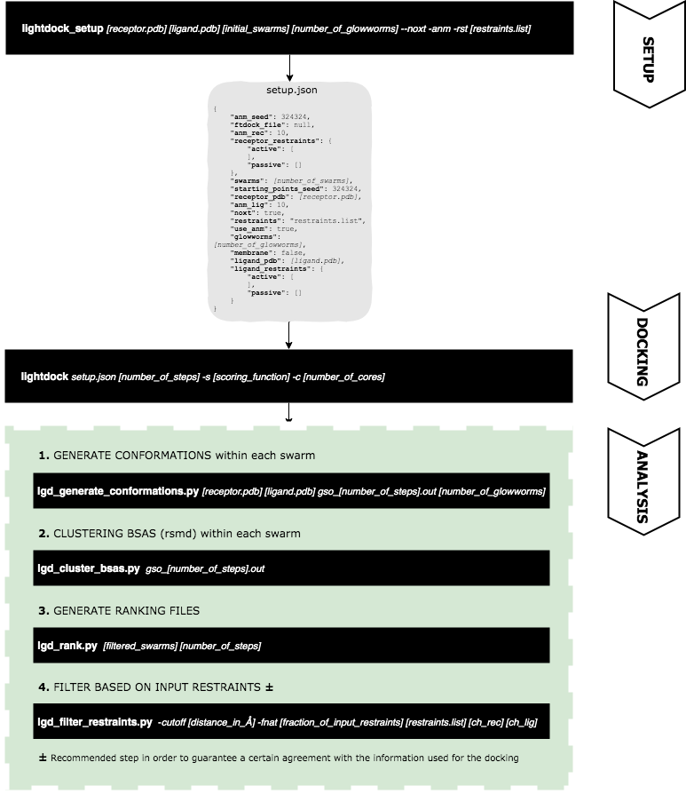

# LightDock Protein-Protein Benchmark 5 Data

## Description

* results: this folder contains for each complex from the BM5 and for each scenario (BLIND, TI, TI-SINGLE, TI-REC, TI-50, TI-25, TI-RANDOM-50 and TI-RANDOM-25) a file with extension `.list` where for each structure predicted by the protocol its name, interface-RMSD, ligand-RMSD, fraction of native contacts and the final score.

* data: for each complex, the initial PDB structures used (`$complex_A-noh.pdb`, `$complex_B-noh.pdb`), the reference (`*.segid.pdb`) and for each scenario `setup.json` and `lightdock.info` files. A script `run.sh` with all the necessary steps to reproduce is available.

* restraints: restraint files used for each of the scenarios above-mentioned named as `$complex-[scenario]-restraints.list`. In the case of the **BLIND** scenario, this file is not available as this scenario corresponds to the full *ab initio* mode.

## Scenarios

* **BLIND**: *ab initio* docking, no restraints used.
* **TI**: true interface residues considered.
* **TI-SINGLE**: only a residue restraints pair is considered, this pair is assured to be interacting.
* **TI-REC**: only residues from the receptor true interface are considered.
* **TI-50**: true interface is split in two parts and extended with residues which are not in the true interface, but are contiguous to the selected patch and don't belong to the other half of true interface residues.
* **TI-25**: true interface is split in four parts and extended with residues which are not in the true interface, but are contiguous to the selected patch and don't belong to any of the other original parts.
* **TI-RANDOM-50**: 50% of the true interface is randomly selected as restraints. 
* **TI-RANDOM-25**: 25% of the true interface is randomly selected as restraints.

## Reproduction of results

For the reported results, the following parameters were used:

* `initial_swarms`: 400
* `number_of_glowworms`: 200
* `number_of_steps`: 100
* `scoring_function`: fastdfire
* `number_of_cores`: 48
* `distance_in_Å`: 5.0
* `fraction_of_input_restraints`: 0.4 (40%)

